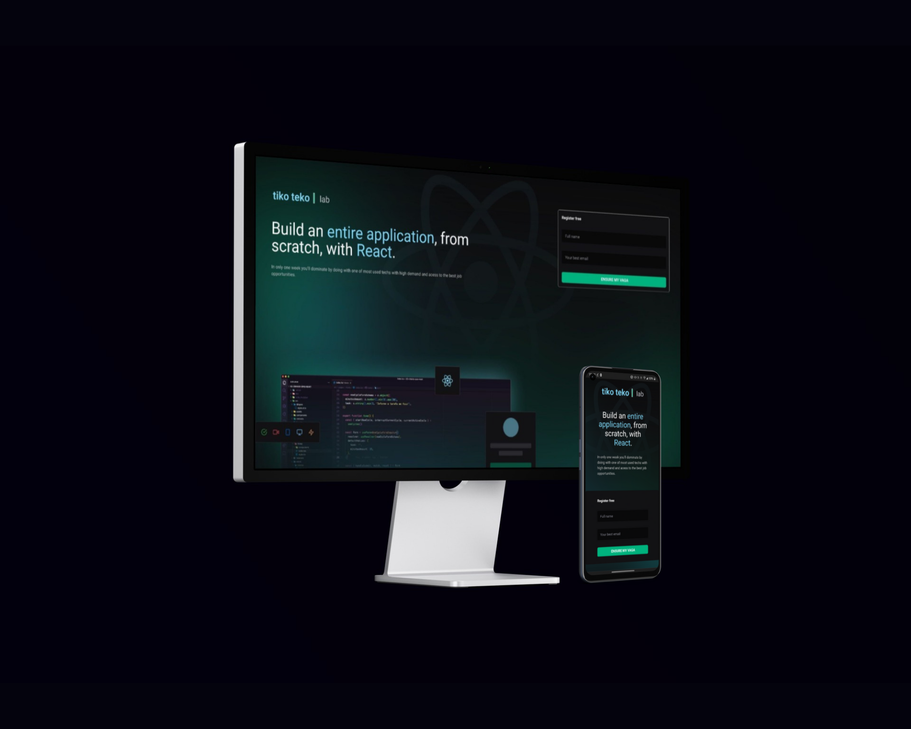

<p align="center">
  
</p>

### Your next great lesson is under a click.


<p align="center">
  
</p>

## Techs and libs used

- React JS.
- Vite.
- GraphCMS.
- Apollo Client.
- GraphQL Codegen.
- Tailwind CSS.
- Phosphor Icons.
<br/>

## Tools used

- NeoVim.
- Visual Studio Code.
- Yarn.
- Figma.
- Smart Mockups.
- Various browsers.
<br/>

## Setup and run

First clone this repository, then install all dependencies using `yarn` command under the project folder in a terminal of you choice.
<br/>
Create an account at GraphCMS and setup content api, permanent access token and add some stuff to you models... A basic model template will be available to clone [here](https://app.graphcms.com/clone/3ee1de4a2d064069a7a6424f449b1197?name=Ignite%20Lab%2002) .<br/>

> obs: The access token and content api uri should be pasted in a .env.local file for further usage in the project. An .env.example is provided to help setup.

<br/>Once setup is done, you're all set, just run `yarn dev` to see the project running on the browser.<br/>

## Features

✅ A user can subscribe to the "event".<br/>
✅ All lessons can be listed in the sidebar on the event page.<br/>
✅ A lesson can be selected and watched in the event page.<br/>
✅ Errors and lessons mismatching are handled with ErrBoundary component.<br/>
✅ Loading states are handled by Loader components.<br/>

> Live: [https://tiko-teko-lab.vercel.app](https://tiko-teko-lab.vercel.app) .

```js
Made under Rocketseat's event Ignite Lab 2nd ed.
Salomão Vasconcelos, 2022 - MIT
```
